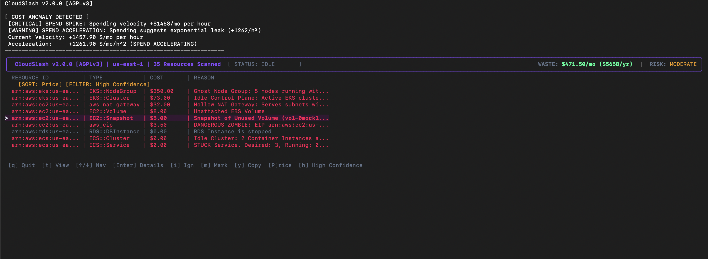
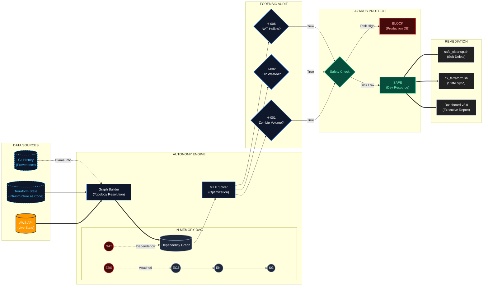
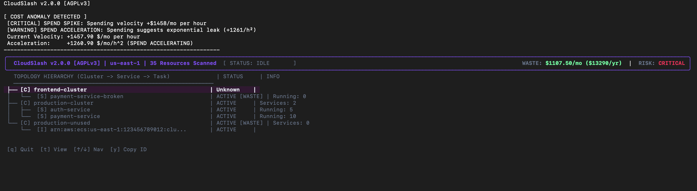
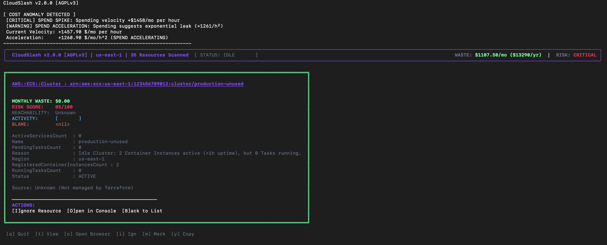
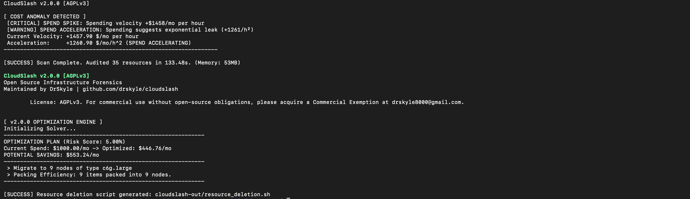
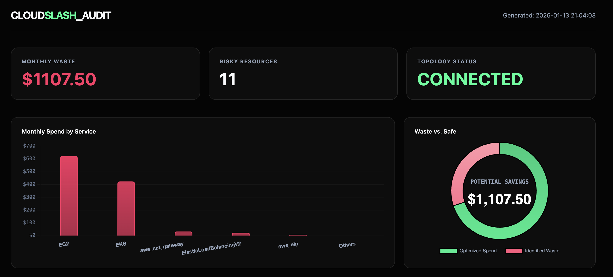
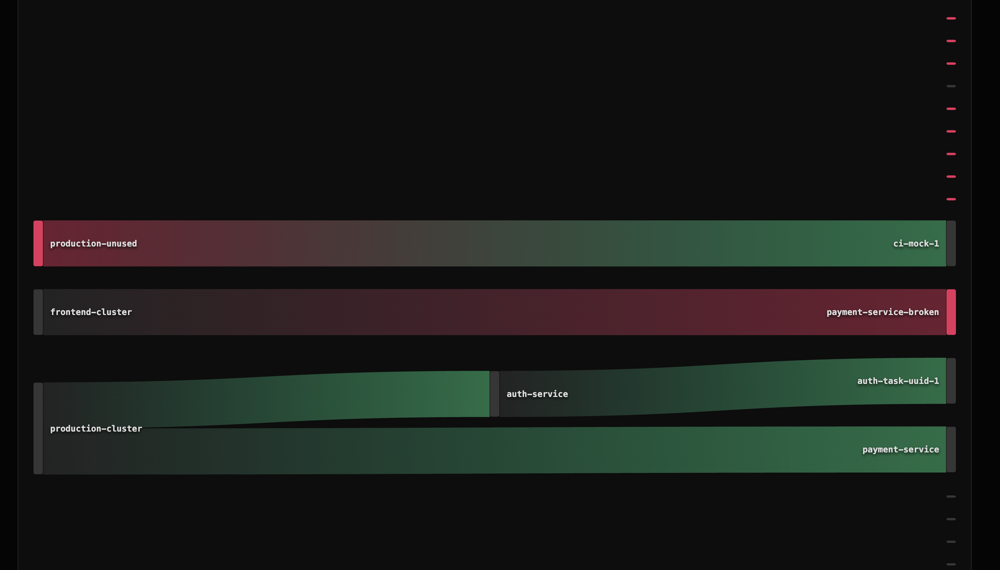

# CloudSlash

   [](https://goreportcard.com/report/github.com/DrSkyle/CloudSlash) [](https://pkg.go.dev/github.com/DrSkyle/CloudSlash)

> **"Infrastructure that heals itself."**

CloudSlash is an autonomous infrastructure optimization platform designed for high-scale, enterprise cloud environments. Unlike passive observability tools that merely report metrics, CloudSlash leverages advanced mathematical modeling, graph topology analysis, and Abstract Syntax Tree (AST) parsing to actively solve resource inefficiency problems at their source.

It functions as a forensic auditor and autonomous agent, correlating disparate data sources—CloudWatch metrics, network traffic logs, infrastructure-as-code (IaC) definitions, and version control history—to identify, attribute, and remediate waste with mathematical certainty.



---

## Installation

### Homebrew (macOS/Linux)

```bash
brew tap DrSkyle/tap
brew install cloudslash
```

### Go Install

```bash
go install github.com/DrSkyle/CloudSlash/cmd/cloudslash-cli@latest
```

### From Source

```bash
git clone https://github.com/DrSkyle/CloudSlash.git
cd CloudSlash
make build
```

### Quick Start

```bash
# Automated Install (Legacy)
curl -sL https://raw.githubusercontent.com/DrSkyle/CloudSlash/main/scripts/install.sh | bash
```

### Windows Users

CloudSlash requires Linux primitives (Bash, SSH, Terraform). **Native Windows (PowerShell/CMD) is not supported.**

**How to run on Windows:**

1.  **Install WSL2**: `wsl --install`
2.  Open Ubuntu/Debian terminal.
3.  Run the **Linux installer** inside WSL.

---

## Executive Summary

Modern cloud environments suffer from "Resource Sprawl"—ghost assets that incur significant financial cost but deliver zero business value. Traditional tools (CloudHealth, Vantage, Trusted Advisor) provide **visibility** but lack **actuation**. They tell you _that_ you are wasting money, but rarely tell you _why_, _who_ caused it, or _how_ to fix it safely.

CloudSlash bridges this gap by combining **Linear Programming** (for fleet optimization) with **Code Provenance** (for attribution). It delivers a closed-loop system that:

1.  **Detects** waste via graph topology analysis.
2.  **Attributes** ownership via git blame and Terraform AST parsing.
3.  **Remediates** safely via the "Lazarus Protocol" (Snapshot -> Stop -> Detach).

**Impact:** Organizations utilizing CloudSlash typically see a **15-25% reduction** in EC2/EBS spend within the first execution cycle.

---

## Core Architecture

CloudSlash is engineered around four distinct intelligence engines:





### 1. The Autonomy Engine (Optimization)

Instead of simple "right-sizing" rules, the Autonomy Engine treats infrastructure as a **Mixed-Integer Linear Programming (MILP)** problem.

- **The Solver:** Calculates the mathematically perfect mix of EC2 instances to satisfy CPU/RAM requirements while minimizing cost.
- **Tetris Engine:** Uses **2D Bin Packing** (Best Fit Decreasing algorithm) to visualize how workloads are fragmented across Kubernetes clusters, identifying "slack" capacity that metrics miss.
- **Bayesian Risk Model:** Tracks Spot Instance interruptions per-AZ, assigning a verifiable "Reliability Score" to every potential instance type to balance cost vs. stability.

### 2. The Provenance Engine (Attribution)

Links every runtime resource ID (e.g., `i-012345`) back to its **Genetic Code**.

- **IaC Correlation:** Uses a full **HCL v2 Abstract Syntax Tree (AST)** parser (not brittle Regex) to mathematically locate the exact resource block definition.
- **Git Blame Integration:** Queries the `.git` directory to identify the specific commit hash, date, and author who introduced the resource.
- **Technical Debt Attribution:** Automatically flags resources created >1 year ago as "Fossilized Code," prompting review for deprecation.

### 3. The Accountability Engine (Identity)

Maps abstract IAM ARNs to tangible corporate identities.

- **Identity Resolution:** Correlates `arn:aws:iam::123:user/jdoe` -> `jdoe@company.com` -> `SlackID: U12345`.
- **Direct Notification:** Sends "Waste Reports" directly to the responsible engineer via Slack, bypassing generic "FinOps" channels to ensure action is taken by the context owner.

### 4. The Performance Architecture (Internals)

CloudSlash is built for speed and scale. We don't just "query APIs"; we model the entire state.

#### Kubernetes: Persistent Event Streams

**Legacy Approach (Iterative List):**

- **Mechanism:** Sequential `List()` API calls with pagination.
- **Latency:** High (Network RTT limited).
- **Impact:** Generates significant load on the API Server and etcd, causing potential 429 throttling on large clusters.

**Current Architecture (Shared Informers & Reflectors):**

- **Mechanism:** Uses the `Reflector` pattern to establish a persistent `WATCH` stream. The client maintains a fully synchronized, local in-memory cache of the cluster state.
- **Performance:** Resource lookups are **O(1)** (local memory access) with zero network latency during analysis.
- **Efficiency:** Drastically reduces Control Plane pressure by consuming only delta events after the initial sync.
- **Trade-off:** Higher client-side memory footprint to store the full object graph (Trade RAM for Speed).

#### Graph Ingestion: The Actor Model

We migrated from a mutex-heavy design to a **Linear Pipeline Actor Model**.

- **Scanning Swarm:** 500+ parallel goroutines fetch data.
- **The Actor:** A single, high-speed goroutine ingests all nodes/edges via a buffered channel, eliminating lock contention entirely.
- **Result:** Graph build times reduced by 90% on large accounts.

### 5. The Lazarus Protocol (Zero-Trust Remediation)

CloudSlash moves beyond "Delete & Pray" to "Freeze & Resurrect". We assume every deletion _might_ be a mistake.

#### Phase 1: The Tombstone Engine

Before touching any resource, we serialize its "Soul" (Configuration, Tags, Relationships, Attachments) into a JSON artifact (`.cloudslash/tombstones/`). Even if AWS deletes the resource, we remember exactly how it was configured.

#### Phase 2: Purgatory Mode (The Litigation Shield)

Default remediation is now **non-destructive**.

- **Freeze**: Resources are tagged with `CloudSlash:Status=Purgatory` and a 30-day specific expiry.
- **Stop**: Instances and databases are stopped.
- **Detach**: Volumes are safely detached, preserving data integrity.
- **Guarantee**: "We didn't delete your data. We just turned it off."

#### Phase 3: The Reanimator (Verified by "Tombstone Recovery" Tests)

A single command restores service to 100% health. This mechanism is mathematically verified by our **Lazarus Protocol E2E Test Suite**, which simulates a full "Provision -> Purge -> Resurrect" lifecycle in a clean-room environment for every build.

- **Soft Resurrection**: Starts instances and **Re-Attaches** volumes to their exact original device paths using Tombstone data.
- **Hard Resurrection**: If a resource is missing, it automatically hunts for the latest Snapshot, creates a new volume, waits for availability (using a robust **Watchdog Loop**), and rebuilds the infrastructure.
- **Terraform Synchronization**: The script automatically heals Terraform state (`state rm` -> `import`), preventing "Drift Detected" errors or zombie state after recovery.

#### Phase 4: Enterprise Safety & Compliance

- **Audit Trail**: Used Tombstones are archived to `.cloudslash/history/restored/` for permanent forensic logs.
- **Idempotent Wrappers**: Scripts detect Terraform State Locks and abort to prevent corruption, distinguishing between harmless "Not Found" errors and critical blockers.

### 6. Defensive Testing Architecture ("Ironclad QA")

CloudSlash ships with a rigorous **End-to-End (E2E) Verification Framework** designed for mission-critical infrastructure tools.

- **The "Silent Runner" Protocol (CI/CD Safety)**:
  Prior to execution, the binary enters a simulation mode that verifies resilience against hostile environments (e.g., missing credentials, network partitions). If the environment is unsafe, CloudSlash degrades gracefully without panicking, ensuring your CI pipeline never breaks due to tool failure.

- **LocalStack Simulation Harness**:
  Our "Rich & Broke" and "Lazarus" test suites spin up ephemeral, offline AWS environments (via Docker/LocalStack) to validate destructive logic. This ensures that **100% of remediation code is tested** without ever touching a real production AWS account.

<details>
<summary><strong>View Heuristics Catalog (Deep Dive)</strong></summary>

### Compute & Serverless

| Detection                  | Logic                                                           | Remediation                               |
| :------------------------- | :-------------------------------------------------------------- | :---------------------------------------- |
| **Lambda Code Stagnation** | 0 Invocations (90d) AND Last Modified > 90d.                    | Delete function or archive code to S3.    |
| **ECS Idle Cluster**       | EC2 instances running for >1h but Cluster has 0 Tasks/Services. | Scale ASG to 0 or delete Cluster.         |
| **ECS Crash Loop**         | Service Desired Count > 0 but Running Count == 0.               | Check Task Definitions / ECR Image pulls. |

### Storage & Database

| Detection            | Logic                                                   | Remediation                                    |
| :------------------- | :------------------------------------------------------ | :--------------------------------------------- |
| **Zombie EBS**       | Volume state is `available` (unattached) for > 14 days. | Snapshot (optional) then Delete.               |
| **Legacy EBS (gp2)** | Volume is `gp2`. `gp3` is 20% cheaper and decoupled.    | Modify Volume to `gp3` (No downtime).          |
| **Fossil Snapshots** | RDS/EBS Snapshot > 90 days old, not attached to AMI.    | Delete old snapshots.                          |
| **RDS Idle**         | 0 Connections (7d) AND CPU < 5%.                        | Stop instance or take final snapshot & delete. |

### Network & Security

| Detection              | Logic                                                              | Remediation                                     |
| :--------------------- | :----------------------------------------------------------------- | :---------------------------------------------- |
| **Hollow NAT Gateway** | Traffic < 1GB (30d) OR Connected Subnets have 0 Running Instances. | Delete NAT Gateway.                             |
| **Dangling EIP**       | EIP unattached but matches an A-Record in Route53.                 | **URGENT:** Update DNS first, then release EIP. |
| **Orphaned ELB**       | Load Balancer has 0 registered/healthy targets.                    | Delete ELB.                                     |

### Containers

| Detection                 | Logic                                               | Remediation                                     |
| :------------------------ | :-------------------------------------------------- | :---------------------------------------------- |
| **ECR Lifecycle Missing** | Repo has images > 90d old but no expiration policy. | Add Lifecycle Policy to expire untagged images. |
| **Log Retention Missing** | CloudWatch Group set to "Never Expire" (>1GB size). | Set retention to 30d/90d.                       |

</details>

---

## Enterprise Capabilities

### 1. Governance as Code (Policy Engine)

CloudSlash embeds a **Common Expression Language (CEL)** engine, enabling custom compliance policies that execute continuously during scans. Unlike static analysis tools, these rules operate on the _live_ dependency graph, utilizing an **Inverted Index** for O(1) performance even with thousands of policies.

> **Architecture Note:** CloudSlash includes powerful **Built-in Heuristics** (detailed in the Deep Dive below) for complex algorithmic analysis (e.g., detecting hollow NAT gateways or zombie clusters). The Policy Engine complements this by enabling you to define specific **Governance Rules** (e.g., "Ban gp2 volumes") without modifying the core codebase.

**Example `rules.yaml`:**

```yaml
rules:
  - id: "enforce_gp3"
    condition: "kind == 'AWS::EC2::Volume' && props.VolumeType == 'gp2'"
    action: "violation"
  - id: "detect_unattached_eip"
    condition: "kind == 'AWS::EC2::EIP' && !has(props.InstanceId)"
    action: "warn"
```

**Flexible Policy Execution:**
Operators can maintain multiple distinct policy files (e.g., `audit.yaml`, `strict-security.yaml`) and apply them selectively at runtime. This enables different compliance standards for Dev/Test vs. Production environments.

```bash
# Execute a specific security policy and output structured JSON for SIEM ingestion
cloudslash scan --rules security-audit-v2.yaml --json > audit_artifact.json
```

### 2. Heterogeneous Fleet Optimization

Beyond standard bin-packing, the **Heterogeneous Solver** implements a sophisticated "Workhorse + Dust" algorithm for Kubernetes rightsizing:

1.  **Workhorse Identification**: Mathematically selects the most cost-efficient instance family for the bulk of the cluster's workload.
2.  **Dust Aggregation**: Identifies "dust" (small, fragmented pods) that would otherwise force an expensive scale-up.
3.  **Mixed-Instance Packing**: Provisions a specific, smaller instance type solely for the dust, creating a mixed fleet that achieves >95% utilization.

### 3. Enterprise Hardening & Security

- **Formal IAM Verification**: Uses `iam:SimulatePrincipalPolicy` (Control Plane simulation) instead of brittle string matching to verify effective permissions. Catches "Admin" roles hidden behind innocuous names.
- **Terraform State Locking**: Automatically detects `terraform.tfstate.lock.info` and strictly aborts operations to prevent race conditions in CI/CD pipelines.
- **Input Sanitization**: All generated remediation scripts (`safe_cleanup.sh`) undergo rigorous Regex validation to prevent shell injection attacks from malicious upstream resource IDs.
- **Structured Observability**: Full support for JSON structured logging via the `--json` flag, allowing direct ingestion into Datadog, Splunk, or ELK stacks without parsing logic.

### 4. Observability Integration (OpenTelemetry)

Built on the "Instrument Once, Export Anywhere" philosophy.

- **Privacy-First (Mode A - Default):**
  CloudSlash generates telemetry internally but writes it to `/dev/null` or stdout. **Zero network traffic.** Your insights stay on your machine.
- **Enterprise Integration (Mode B):**
  Configure the endpoint via CLI flag, environment variable, or `cloudslash.yaml`. Streams live **Traces** and **Metrics** to your internal backend via OTLP/HTTP.

  ```bash
  # Option 1: CLI Flag
  cloudslash scan --otel-endpoint "http://localhost:4318"

  # Option 2: Config File (Recommended)
  # ~/.cloudslash/cloudslash.yaml
  otel_endpoint: "http://jaeger:4318"
  ```

**Golden Signals Instrumented:**

1.  **Crash Handler:** Panics are caught as "CriticalPanic" spans with full stack traces (no local files written).
2.  **Scanner Swarm:** Every worker job is traced with attribution (`provider`, `region`, `profile`) to identify throttling or latency.
3.  **Policy Engine:** Violations emit high-cardinality metrics (`policy_violations_total`) tagged by Rule ID.

---

## Competitive Analysis

CloudSlash stands apart by focusing on _root cause resolution_ rather than just _reporting_.

| Feature                | **CloudSlash**                   | AWS Trusted Advisor     | Cloud Custodian    | Vantage / CloudHealth   |
| :--------------------- | :------------------------------- | :---------------------- | :----------------- | :---------------------- |
| **Primary Goal**       | **Automated Remediation**        | Basic Visibility        | Policy Enforcement | Financial Reporting     |
| **Logic Engine**       | **Graph Topology (DAG)**         | Simple Metrics          | Stateless Rules    | Aggregated Billing Data |
| **Remediation**        | **Interactive TUI & Scripts**    | None (Manual)           | Lambda (Black Box) | None (Manual)           |
| **Safety**             | **Soft-Delete / Snapshot first** | N/A                     | Hard Delete        | N/A                     |
| **Attribution**        | **Git Commit & Author**          | None                    | Tag-based          | Tag-based               |
| **IaC Awareness**      | **Terraform AST Parsing**        | None                    | None               | None                    |
| **Dependency Mapping** | **Full Graph Visualization**     | None                    | None               | None                    |
| **Cost**               | **OSS / Self-Hosted**            | Enterprise Support plan | OSS                | $$ SaaS Subscription    |

---

---

## Programmatic SDK Usage

CloudSlash has been re-architected as a modular Go library (`pkg/engine`). The CLI/TUI is simply a consumer of this core SDK. You can import the engine directly to embed CloudSlash's unique waste detection logic into your own internal tools, IDPs (Backstage), or CI pipelines.

```go
package main

import (
    "context"
    "fmt"
    "log/slog"

    "github.com/DrSkyle/cloudslash/pkg/engine"
)

func main() {
    // 1. Configure the Analysis Engine
    config := engine.Config{
        Region:           "us-east-1",
        Headless:         true,  // Disable TUI
        JsonLogs:         true,  // Structured logging
        DisableCWMetrics: false, // Enable full CloudWatch lookups
    }

    // 2. Execute the Scan (returns the live Dependency Graph)
    success, graph, _, err := engine.Run(context.Background(), config)
    if err != nil {
        slog.Error("Scan failed", "error", err)
        return
    }

    if success {
        // 3. Programmatically access detected waste
        fmt.Printf("Analysis Complete. Found %d total nodes.\n", len(graph.Nodes))
        for _, node := range graph.Nodes {
            if node.IsWaste {
                fmt.Printf(" [WASTE] %s ($%.2f/mo) - %s\n", node.ID, node.Cost, node.WasteReason)
            }
        }
    }
}
```

---

## Permissions & Security

### Data Protection (Local State)

CloudSlash maintains a local history ledger at `~/.cloudslash/ledger.jsonl` to calculate cost velocity and burn rates.

> [!WARNING]
> **Sensitivity Warning**: While this file **does not** contain AWS credentials or secrets, it stores metadata about your infrastructure (resource IDs, types, and cost data).
>
> **Recommendation**: Ensure your workstation uses **Full Disk Encryption** (FileVault/BitLocker) and set restrictive file permissions:
>
> ```bash
> chmod 600 ~/.cloudslash/ledger.jsonl
> ```

### Least Privilege Setup

Don't want to give CloudSlash full admin? No problem.
Run this to generate the _exact_ minimal JSON policy needed:

```bash
cloudslash permissions > policy.json
```

Attach that policy to your IAM Role. It's read-only and scoped tightly.

---

## Configuration

The tool utilizes the standard AWS Credential Chain (`~/.aws/credentials` or `ENV` vars). Ensure your environment is configured for the target account:

```bash
export AWS_PROFILE=production
export AWS_REGION=us-east-1
# Optional: Target a custom endpoint (compatible with LocalStack or Private Cloud)
export AWS_ENDPOINT_URL="http://localhost:4566"
```

For persistent configuration, create a `cloudslash.yaml` in your root directory (`~/.cloudslash/cloudslash.yaml` or current dir).

```yaml
# ~/.cloudslash/cloudslash.yaml
region: "us-east-1"
json_logs: true # Machine-readable logs
rules_file: "my_rules.yaml" # Path to policy rules
max_workers: 20 # Speed up scans
```

CloudSlash respects precedence: `CLI Flags` > `ENV Vars` > `Config File` > `Defaults`.

---

## Resource Exclusion & Tagging Policy

CloudSlash respects specific resource tags to allow for granular control over waste detection. Organizations can define retention policies or explicitly exclude resources from analysis using the `cloudslash:ignore` tag key.

### Exclusion Logic

To exclude a resource from the waste report, apply the tag `cloudslash:ignore` with one of the following value formats:

- **Boolean:** Set to `true` to permanently exclude the resource from all analysis.
- **Expiration Date:** Set a date in `YYYY-MM-DD` format (e.g., `2027-01-01`). The resource will be ignored until this date is reached.
- **Retention Period:** Set a duration with a `d` (days) or `h` (hours) suffix (e.g., `120d`). The resource will be ignored if its age is less than the specified duration.

### Application to AMIs

The logic described above applies to all supported resources, including Amazon Machine Images (AMIs). For example, to enforce a custom retention policy for a specific backup AMI, apply the tag `cloudslash:ignore` with value `180d`. This overrides the default heuristic and ensures the image is only flagged as waste after 180 days have elapsed.

### Effect

Resources matching the exclusion criteria are removed from the interactive TUI, the JSON output, and the Executive Dashboard. They will not be counted towards waste totals or financial deficiency metrics.

---

## Usage Guide

### 1. Analysis Scan

The primary entry point. Orchestrates the graph resolution and waste detection.

```bash
cloudslash scan [flags]
```

**Flags:**

- `--headless`: Disables the TUI. Recommended for CI/CD pipelines.
- `--region <list>`: Comma-separated target regions (e.g., `us-east-1,eu-central-1`).
- `--json`: Enable structured JSON logging for observability tools (Datadog, Splunk).
- `--rules <file>`: Load custom policy rules (CEL) to flag specific violations.
- `--no-metrics`: Skip CloudWatch API calls (faster, but less accurate).

**Interactive TUI Controls:**

- `h` / `l`: Navigate hierarchy.
- `t`: Toggle Topology Visualization.
- `SPACE`: Mark resource for remediation.
- `ENTER`: View detailed resource inspection (Cost, Tags, Provenance).



### 2. Remediation Console

The interactive cleanup interface. Reads the graph and prompts for safe deletion.

```bash
cloudslash cleanup
```

_Note: This command generates executable shell scripts (`safe_cleanup.sh`) in the `cloudslash-out/` directory for manual review before execution._



### 3. Executive Reporting

CloudSlash generates a self-contained HTML dashboard for stakeholders, featuring financial projections and Sankey cost flow diagrams.




### 4. Manifest of Artifacts (Output Reference)

Upon completion of an audit cycle, CloudSlash generates a suite of remediation artifacts within the configured output directory (default: `cloudslash-out/`). These artifacts serve as the interface for operationalizing the audit findings.

- **`waste_report.json`**: A machine-readable structural analysis of identified inefficiencies. This file is intended for ingestion by downstream observability platforms or custom automation pipelines.
- **`safe_cleanup.sh`**: The primary remediation executable. This script implements the "Purgatory Protocol," performing non-destructive actions (instance stoppage, volume detachment, snapshot creation) to neutralize cost accumulation while preserving data integrity.
- **`fix_terraform.sh`**: A state reconciliation script designed to remove identified "Zombie Resources" from the Terraform state. Execution of this script prevents state drift errors during subsequent infrastructure modification.
- **`undo_cleanup.sh`**: The recovery executable for the Lazarus Protocol. This script reverses the actions of `safe_cleanup.sh`, restoring resources to their operational state using the preserved metadata.
- **`restore.tf`**: A Terraform configuration file containing generated `import` blocks. This facilitates the re-assimilation of previously deleted or detached resources back into Terraform management.
- **`waste.tf` & `import.sh`**: Advanced Terraform-native remediation artifacts. These files allow for the importation of unmanaged waste resources into a temporary Terraform state, enabling destruction via standard `terraform destroy` workflows rather than direct API calls.

### 5. Recommended Remediation Workflow (Gold Standard)

For maximum safety and data integrity, we recommend the following execution order when processing audit results:

1.  **Review the Intelligence**: Open `dashboard.html` to visually confirm the graph topology and high-cost centers.
2.  **Harmonize State**: Run `./cloudslash-out/fix_terraform.sh` _first_. This ensures your Terraform state is consistent with reality, preventing "Drift Detected" errors during later steps.
3.  **Execute Purgatory**: Run `./cloudslash-out/safe_cleanup.sh`. This stops instances and snapshots volumes without deleting data, immediately stopping the "money burn."
4.  **Verify & Wait**: Observe the environment for 24-48 hours. If no alarms trigger, the remediation is successful.
5.  **Emergency Rollback**: If a service interruption occurs, immediately run `./cloudslash-out/undo_cleanup.sh` to restore all resources to their exact pre-cleanup state.

---

## Support the Project

CloudSlash is open source and free. If you'd like to support development or need priority help:

- **[Support ($9.99/mo)](https://checkout.freemius.com/app/22411/plan/37525/)** - Priority Support & Gratitude.
- **[Super Support ($19.99/mo)](https://checkout.freemius.com/app/22411/plan/37513/)** - Prioritized Feature Requests & Sponsor Recognition.

---

## Enterprise Support & Licensing

CloudSlash is released under the **AGPLv3** license.

- **Internal Use:** You are free to use CloudSlash internally to audit your own infrastructure.
- **Commercial Use:** If you modify CloudSlash and provide it as a service or product to external clients, you must open-source your changes.

**Commercial Exemption:**
If your organization requires a commercial license for AGPL compliance (e.g., embedding CloudSlash in proprietary software without releasing source code), exemptions are available.

**Contact:** [drskyle8000@gmail.com](mailto:drskyle8000@gmail.com)

---

## Uninstallation

To remove CloudSlash from your system:

```bash
# 1. Remove binary
sudo rm /usr/local/bin/cloudslash

# 2. Remove configuration
rm ~/.cloudslash.yaml

# 3. Remove reports (optional)
rm -rf cloudslash-out/
```

---

## Acknowledgments

CloudSlash v2.0 was developed with a philosophy of "Zero Waste." We acknowledge the open-source community for the robust libraries that make this engine possible.

**Copyright © 2026 DrSkyle.**
