# CloudSlash

  

**The Forensic Cloud Accountant for AWS.**

CloudSlash is a **local-first, open-source** command line tool that bridges the gap between FinOps (Cost) and SecOps (Risk). It correlates CloudWatch metrics with network topology to identify "Zombie" infrastructure that standard tools miss—reducing both your AWS bill and your attack surface.

## The Architecture: Graph-Based Heuristics

Most cloud tools simply list resources via API calls (e.g., `aws ec2 describe-instances`). CloudSlash takes a fundamentally different approach. It builds a **Directed Acyclic Graph (DAG)** of your entire AWS infrastructure in memory.

By mapping the edges between resources (Safety Groups -> ENIs -> Instances -> Subnets), CloudSlash can mathematically prove isolation. If a NAT Gateway has an **In-Degree of 0** (no active subnets or instances routing to it), it is hollow. This topological analysis prevents false positives that occur when relying solely on CloudWatch metrics.



### The Heuristic Swarm

An autonomous swarm of detection engines crawls this graph to identify specific patterns of waste and risk:

- **The Vampire Hunter:** Identifies NAT Gateways that are idle. These are often the most expensive accidental costs in AWS.
- **The Ghost Buster:** Detects EKS/ECS control planes that are running but have 0 nodes or 0 pods scheduled.
- **The Time Traveler:** Finds RDS Snapshots > 90 days old that are detached from any active cluster.
- **The Safety Lock:** preventing "Subdomain Takeover" by cross-referencing Elastic IPs against Route53 A-Records before release.

## The Killer Feature: Terraform Bridge

**The State Doctor.**

If you find a zombie resource in the AWS Console and delete it manually, you break your Terraform State. The next `terraform apply` will fail because the remote resource is missing.

CloudSlash solves this by reverse-mapping AWS IDs (`i-12345`) to Terraform State addresses (`module.vpc.aws_instance.main`). It generates a surgical shell script (`fix_terraform.sh`) to remove _just_ the identified waste from your state file:

```bash
terraform state rm module.vpc.aws_nat_gateway.main
```

This allows engineers to clean up waste safely without corrupting their Infrastructure as Code.

## Quick Start

**macOS / Linux**

```bash
curl -sL https://raw.githubusercontent.com/DrSkyle/CloudSlash/main/dist/install.sh | bash
```

**Windows (PowerShell)**

```powershell
irm https://raw.githubusercontent.com/DrSkyle/CloudSlash/main/dist/install.ps1 | iex
```

**Run Analysis**

```bash
cloudslash
```

## Key Capabilities

<details>
<summary><strong>View Heuristics Catalog (Deep Dive)</strong></summary>

### Compute & Serverless

| Detection                  | Logic                                                           | Remediation                               |
| :------------------------- | :-------------------------------------------------------------- | :---------------------------------------- |
| **Lambda Code Stagnation** | 0 Invocations (90d) AND Last Modified > 90d.                    | Delete function or archive code to S3.    |
| **ECS Idle Cluster**       | EC2 instances running for >1h but Cluster has 0 Tasks/Services. | Scale ASG to 0 or delete Cluster.         |
| **ECS Crash Loop**         | Service Desired Count > 0 but Running Count == 0.               | Check Task Definitions / ECR Image pulls. |

### Storage & Database

| Detection            | Logic                                                   | Remediation                                    |
| :------------------- | :------------------------------------------------------ | :--------------------------------------------- |
| **Zombie EBS**       | Volume state is `available` (unattached) for > 14 days. | Snapshot (optional) then Delete.               |
| **Legacy EBS (gp2)** | Volume is `gp2`. `gp3` is 20% cheaper and decoupled.    | Modify Volume to `gp3` (No downtime).          |
| **Fossil Snapshots** | RDS/EBS Snapshot > 90 days old, not attached to AMI.    | Delete old snapshots.                          |
| **RDS Idle**         | 0 Connections (7d) AND CPU < 5%.                        | Stop instance or take final snapshot & delete. |

### Network & Security

| Detection                   | Logic                                                              | Remediation                                     |
| :-------------------------- | :----------------------------------------------------------------- | :---------------------------------------------- |
| **Hollow NAT Gateway**      | Traffic < 1GB (30d) OR Connected Subnets have 0 Running Instances. | Delete NAT Gateway.                             |
| **Dangling EIP (Critical)** | EIP unattached but matches an A-Record in Route53.                 | **URGENT**: Update DNS first, then release EIP. |
| **Orphaned ELB**            | Load Balancer has 0 registered/healthy targets.                    | Delete ELB.                                     |

### Containers

| Detection                 | Logic                                               | Remediation                                     |
| :------------------------ | :-------------------------------------------------- | :---------------------------------------------- |
| **ECR Lifecycle Missing** | Repo has images > 90d old but no expiration policy. | Add Lifecycle Policy to expire untagged images. |
| **Log Retention Missing** | CloudWatch Group set to "Never Expire" (>1GB size). | Set retention to 30d/90d.                       |

</details>

## Reporting & Output

- **Dashboard (HTML)**: Interactive report with charts (`cloudslash-out/dashboard.html`).
- **Data Export**: Raw `waste_report.csv` and `waste_report.json`.
- **Executive Summary**: Markdown audit brief (`executive_summary.md`).

## Support the Project

CloudSlash is open source and free. If you'd like to support development or need priority help:

[**Support ($9.99/mo)**](https://checkout.freemius.com/app/22411/plan/37525/) - Priority Support & Gratitude.

[**Super Support ($19.99/mo)**](https://checkout.freemius.com/app/22411/plan/37513/) - Direct Access & Custom Integration Help.

## License & Commercial Use

**CloudSlash is AGPLv3.**

You are free to use it, modify it, and run it internally for your business.
_If you modify CloudSlash and provide it as a service/product to others, you must open-source your changes._

**Enterprise Exemption**:
If your organization requires a commercial license for AGPL compliance (e.g., embedding CloudSlash in proprietary software without releasing source code), exemptions are available.
Contact: `drskyle8000@gmail.com`

---

Made with ❤️ by DrSkyle
