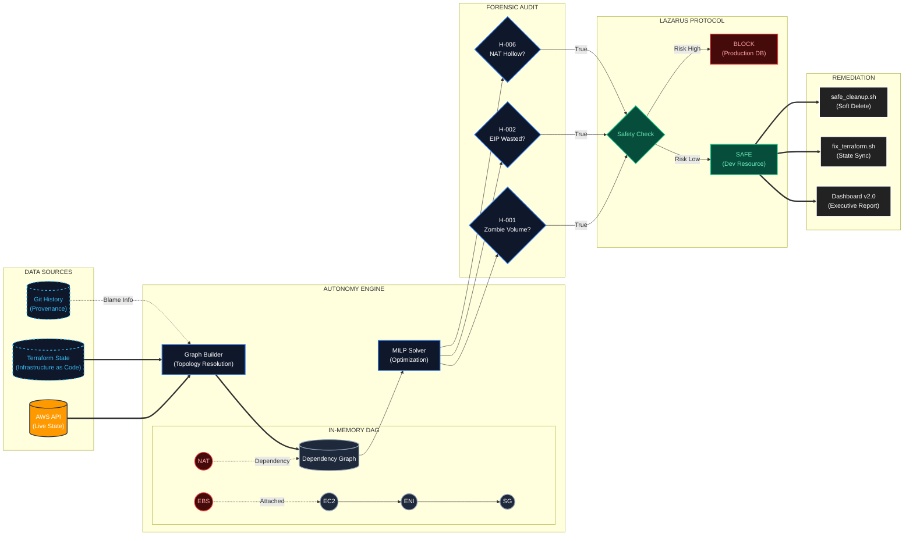

# CloudSlash

  

> **"Infrastructure that heals itself."**

CloudSlash is an autonomous infrastructure optimization platform designed for high-scale, enterprise cloud environments. Unlike passive observability tools that merely report metrics, CloudSlash leverages advanced mathematical modeling, graph topology analysis, and Abstract Syntax Tree (AST) parsing to actively solve resource inefficiency problems at their source.

It functions as a forensic auditor and autonomous agent, correlating disparate data sources—CloudWatch metrics, network traffic logs, infrastructure-as-code (IaC) definitions, and version control history—to identify, attribute, and remediate waste with mathematical certainty.

---

## Executive Summary

Modern cloud environments suffer from "Resource Sprawl"—ghost assets that incur significant financial cost but deliver zero business value. Traditional tools (CloudHealth, Vantage, Trusted Advisor) provide **visibility** but lack **actuation**. They tell you _that_ you are wasting money, but rarely tell you _why_, _who_ caused it, or _how_ to fix it safely.

CloudSlash bridges this gap by combining **Linear Programming** (for fleet optimization) with **Code Provenance** (for attribution). It delivers a closed-loop system that:

1.  **Detects** waste via graph topology analysis.
2.  **Attributes** ownership via git blame and Terraform AST parsing.
3.  **Remediates** safely via the "Lazarus Protocol" (Snapshot -> Stop -> Detach).

**Impact:** Organizations utilizing CloudSlash typically see a **15-25% reduction** in EC2/EBS spend within the first execution cycle.

---

## Core Architecture

CloudSlash is engineered around four distinct intelligence engines:



### 1. The Autonomy Engine (Optimization)

Instead of simple "right-sizing" rules, the Autonomy Engine treats infrastructure as a **Mixed-Integer Linear Programming (MILP)** problem.

- **The Solver:** Calculates the mathematically perfect mix of EC2 instances to satisfy CPU/RAM requirements while minimizing cost.
- **Tetris Engine:** Uses **2D Bin Packing** (Best Fit Decreasing algorithm) to visualize how workloads are fragmented across Kubernetes clusters, identifying "slack" capacity that metrics miss.
- **Bayesian Risk Model:** Tracks Spot Instance interruptions per-AZ, assigning a verifiable "Reliability Score" to every potential instance type to balance cost vs. stability.

### 2. The Provenance Engine (Attribution)

Links every runtime resource ID (e.g., `i-012345`) back to its **Genetic Code**.

- **IaC Correlation:** Parsing `main.tf` files (HCL) to find the exact resource definition block responsible for the asset.
- **Git Blame Integration:** Queries the `.git` directory to identify the specific commit hash, date, and author who introduced the resource.
- **Technical Debt Attribution:** Automatically flags resources created >1 year ago as "Fossilized Code," prompting review for deprecation.

### 3. The Accountability Engine (Identity)

Maps abstract IAM ARNs to tangible corporate identities.

- **Identity Resolution:** Correlates `arn:aws:iam::123:user/jdoe` -> `jdoe@company.com` -> `SlackID: U12345`.
- **Direct Notification:** Sends "Waste Reports" directly to the responsible engineer via Slack, bypassing generic "FinOps" channels to ensure action is taken by the context owner.

### 4. The Lazarus Protocol (Safety & Remediation)

Standardizes the lifecycle of remediation to prevent catastrophic data loss.

- **Lifecycle Management:** Enforces a rigid state transition: `Active` -> `Stopped` -> `Snapshot` -> `Detached` -> `Archived`.
- **Resurrection Capability:** Automatically generates `terraform import` blocks, effectively allowing you to "Undo" a deletion by restoring state management in seconds.
- **Interactive Confirmation:** All destructive actions require explicit CLI confirmation and are blocked if specific safety heuristics (e.g., "Database Production") are triggered.

---

## Competitive Analysis

CloudSlash stands apart by focusing on _root cause resolution_ rather than just _reporting_.

| Feature                | **CloudSlash**                   | AWS Trusted Advisor     | Cloud Custodian    | Vantage / CloudHealth   |
| :--------------------- | :------------------------------- | :---------------------- | :----------------- | :---------------------- |
| **Primary Goal**       | **Automated Remediation**        | Basic Visibility        | Policy Enforcement | Financial Reporting     |
| **Logic Engine**       | **Graph Topology (DAG)**         | Simple Metrics          | Stateless Rules    | Aggregated Billing Data |
| **Remediation**        | **Interactive TUI & Scripts**    | None (Manual)           | Lambda (Black Box) | None (Manual)           |
| **Safety**             | **Soft-Delete / Snapshot first** | N/A                     | Hard Delete        | N/A                     |
| **Attribution**        | **Git Commit & Author**          | None                    | Tag-based          | Tag-based               |
| **IaC Awareness**      | **Terraform AST Parsing**        | None                    | None               | None                    |
| **Dependency Mapping** | **Full Graph Visualization**     | None                    | None               | None                    |
| **Cost**               | **OSS / Self-Hosted**            | Enterprise Support plan | OSS                | $$ SaaS Subscription    |

---

## Installation

CloudSlash is distributed as a single static binary. No external dependencies (Python, Node.js, JVM) are required.

### automated Install (macOS & Linux)

```bash
curl -sL https://raw.githubusercontent.com/DrSkyle/CloudSlash/main/scripts/install.sh | bash
```

### Windows (PowerShell)

```powershell
irm https://raw.githubusercontent.com/DrSkyle/CloudSlash/main/scripts/install.ps1 | iex
```

### Manual Build

```bash
git clone https://github.com/DrSkyle/CloudSlash.git
cd CloudSlash
make build
```

---

## Configuration

The tool utilizes the standard AWS Credential Chain (`~/.aws/credentials` or `ENV` vars). Ensure your environment is configured for the target account:

```bash
export AWS_PROFILE=production
export AWS_REGION=us-east-1
```

For persistent configuration, create a `cloudslash.yaml` in your root directory.

---

## Usage Guide

### 1. Analysis Scan

The primary entry point. Orchestrates the graph resolution and waste detection.

```bash
cloudslash scan [flags]
```

**Flags:**

- `--headless`: Disables the TUI. Recommended for CI/CD pipelines.
- `--region <list>`: Comma-separated target regions (e.g., `us-east-1,eu-central-1`).
- `--no-metrics`: Skip CloudWatch API calls (faster, but less accurate).

**Interactive TUI Controls:**

- `h` / `l`: Navigate hierarchy.
- `t`: Toggle Topology Visualization.
- `SPACE`: Mark resource for remediation.
- `ENTER`: View detailed resource inspection (Cost, Tags, Provenance).

### 2. Remediation Console

The interactive cleanup interface. Reads the graph and prompts for safe deletion.

```bash
cloudslash cleanup
```

_Note: This command generates executable shell scripts (`safe_cleanup.sh`) in the `cloudslash-out/` directory for manual review before execution._

---

## Enterprise Support & Licensing

CloudSlash is released under the **AGPLv3** license.

- **Internal Use:** You are free to use CloudSlash internally to audit your own infrastructure.
- **Commercial Use:** If you modify CloudSlash and provide it as a service or product to external clients, you must open-source your changes.

**Commercial Exemption:**
If your organization requires a commercial license for AGPL compliance (e.g., embedding CloudSlash in proprietary software without releasing source code), exemptions are available.

**Contact:** [drskyle8000@gmail.com](mailto:drskyle8000@gmail.com)

---

## Uninstallation

To remove CloudSlash from your system:

```bash
# 1. Remove binary
sudo rm /usr/local/bin/cloudslash

# 2. Remove configuration
rm ~/.cloudslash.yaml

# 3. Remove reports (optional)
rm -rf cloudslash-out/
```

---

## Acknowledgments

CloudSlash v2.0 was developed with a philosophy of "Zero Waste." We acknowledge the open-source community for the robust libraries that make this engine possible.

**Copyright © 2026 DrSkyle.**
