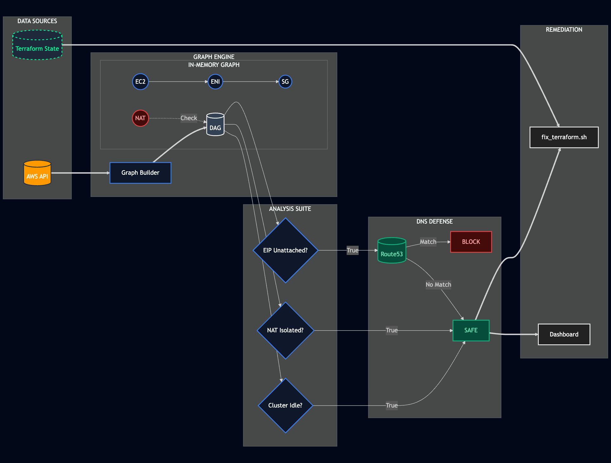

# CloudSlash v2.0

 

**Autonomous Cloud Infrastructure Optimization.**

CloudSlash is a **local-first, open-source** command line tool that identifies unused, misconfigured, and costly infrastructure. It correlates CloudWatch metrics with network topology to detect waste that standard cost tools often miss—reducing both AWS spend and attack surface.

## Architecture: Graph-Based Analysis

CloudSlash builds an in-memory **Directed Acyclic Graph (DAG)** of your AWS environment to perform deep topological analysis.

Unlike tools that rely solely on list APIs (e.g., `aws ec2 describe-instances`), CloudSlash maps dependencies between resources (e.g., `Subnet -> RouteTable -> NAT Gateway`). This allows it to mathematically prove resource isolation. For example, a NAT Gateway is only flagged as waste if it has **zero active dependencies**, eliminating false positives common with simple metric-based thresholds.



### Detection Capabilities

CloudSlash employs multiple heuristic engines to identify specific patterns of inefficiency:

- **Idle NAT Gateways:** Identifies gateways with low throughput and no active upstream dependencies.
- **Orphaned Control Planes:** Detects EKS/ECS clusters that are active but have zero nodes or scheduled tasks.
- **Detached Snapshots:** Identifies RDS/EBS snapshots older than 90 days that are not linked to any active AMI or cluster.
- **Unattached Elastic IPs:** Cross-references available EIPs against Route53 A-Records to prevent subdomain takeovers before release.

## Terraform Integration

**State-Aware Remediation**

Deleting resources manually in the AWS Console causes drift in Terraform state. CloudSlash addresses this by mapping AWS Resource IDs to their corresponding Terraform State addresses.

It generates a surgical script (`fix_terraform.sh`) to safely remove identified waste from your state file:

```bash
terraform state rm module.vpc.aws_nat_gateway.main
```

This ensures that cleanup operations do not corrupt your Infrastructure as Code state.

## Quick Start

**macOS / Linux**

```bash
curl -sL https://raw.githubusercontent.com/DrSkyle/CloudSlash/main/dist/install.sh | bash
```

**Windows (PowerShell)**

```powershell
irm https://raw.githubusercontent.com/DrSkyle/CloudSlash/main/dist/install.ps1 | iex
```

**Run Analysis**

```bash
cloudslash
```

## Features (v1.3.6)

- **Spend Velocity Tracking**: Calculates the rate of spend change (`$/hr`) to predict budget overruns.
- **Anomaly Detection**: Identifies abnormal cost spikes using historical baselines.
- **Local Data Privacy**: All analysis runs locally; credentials and data never leave your machine.

## Heuristics Catalog

<details>
<summary><strong>View Detailed Detection Logic</strong></summary>

### Compute & Serverless

| Detection                  | Logic                                             | Remediation                       |
| :------------------------- | :------------------------------------------------ | :-------------------------------- |
| **Stale Lambda Functions** | 0 Invocations (90d) AND Last Modified > 90d.      | Delete function or archive.       |
| **Idle ECS Clusters**      | Active EC2 instances but 0 Tasks/Services.        | Scale ASG to 0 or delete Cluster. |
| **ECS Crash Loops**        | Service Desired Count > 0 but Running Count == 0. | Inspect Task Definitions/Image.   |

### Storage & Database

| Detection                  | Logic                               | Remediation                     |
| :------------------------- | :---------------------------------- | :------------------------------ |
| **Unattached EBS Volumes** | State is `available` for > 14 days. | Snapshot and Delete.            |
| **Legacy Storage (gp2)**   | Volume type is `gp2`.               | Migrate to `gp3` (20% savings). |
| **Old Snapshots**          | Snapshot > 90 days old, unattached. | Delete.                         |
| **Idle RDS Instances**     | 0 Connections (7d) AND CPU < 5%.    | Stop or Snapshot & Delete.      |

### Network & Security

| Detection                   | Logic                                         | Remediation               |
| :-------------------------- | :-------------------------------------------- | :------------------------ |
| **Unused NAT Gateways**     | Traffic < 1GB (30d) OR 0 connected instances. | Delete NAT Gateway.       |
| **Unattached EIPs**         | Unattached IP matching a Route53 Record.      | Update DNS, then Release. |
| **Orphaned Load Balancers** | ELB with 0 healthy targets.                   | Delete ELB.               |

### Containers

| Detection                 | Logic                                     | Remediation                |
| :------------------------ | :---------------------------------------- | :------------------------- |
| **ECR Lifecycle Missing** | Repo > 90d old without expiration policy. | Add Lifecycle Policy.      |
| **Log Retention Missing** | CloudWatch Group set to "Never Expire".   | Set retention (e.g., 90d). |

</details>

## Reporting

- **Dashboard**: HTML report with visualization charts (`cloudslash-out/dashboard.html`).
- **Data Export**: CSV and JSON formats (`waste_report.csv`, `waste_report.json`).
- **Executive Summary**: High-level audit brief (`executive_summary.md`).

## Support

For priority support or feature requests:

- [**Commercial Support**](https://checkout.freemius.com/app/22411/plan/37525/)

## License

**AGPLv3**

Free for internal use. Modification and redistribution as a service requires open-sourcing changes.
Commercial exemptions available for enterprise embedding. Contact: `drskyle8000@gmail.com`
